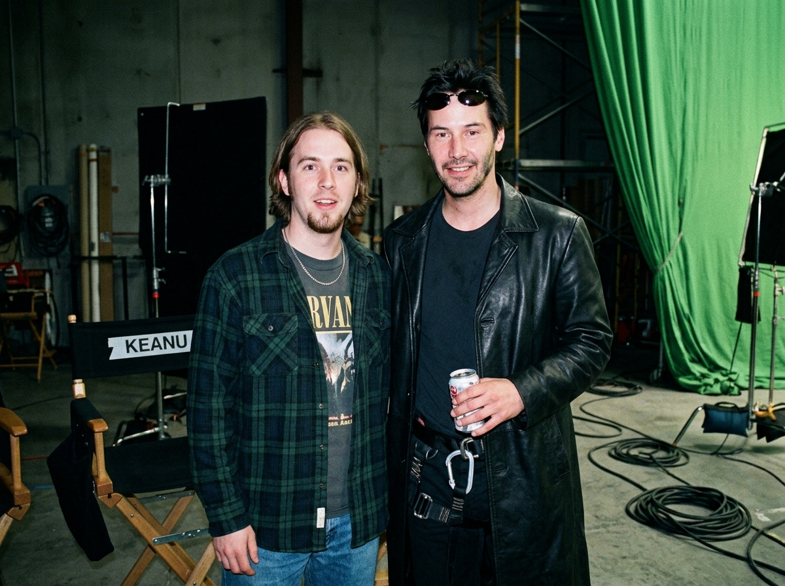
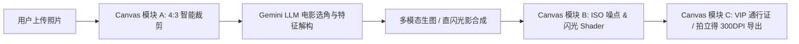

# 🎬 CandidSet - BTS Movie Soundstage Cameo Generator (电影片场探班生成器)

<div align="center">



**An AI-Powered Web Application that creates ultra-photorealistic Behind-The-Scenes (BTS) candid snapshot photos with movie stars resting on authentic film sets.**

[](https://github.com/)
[](https://aistudio.google.com/)
[](https://developer.mozilla.org/)
[](LICENSE)

</div>

---

## 🌟 核心创意与破壁体验 (Core Highlights)

大部分 AI 生图只是将人物简单抠图拼贴，充斥着廉价的“油画感”与“假人感”。**CandidSet** 专注于解决**“探班真实感”**的核心痛点：

1. **破壁反差装造 (Diegetic Contrast)**：
   * 电影主角身穿高精度的戏服/特效妆（如及踝黑皮风衣、战损绷带、弗雷曼蒸馏服），却做着极度生活化的休息动作（手握冰可乐、分吃披萨、看手机、比耶自拍）。
2. **片场穿帮元素 (Soundstage Clutter)**：
   * 背景强制渲染真实的片场环境：贴有演员名字的折叠导演椅（如 `KEANU`、`JOKER`）、360度绿色幕布折痕、地面积水与粗橡胶线缆、C-Stand 金属灯架与实木场记板。
3. **一人一采同源打光物理 (Flash-on Relighting)**：
   * **强高光 (Specular Highlights)**：用户与演员面部、额头同步被打上机顶强闪光的点状高光过曝；
   * **硬投影 (Drop Shadow)**：两人身后的背景墙上投下轮廓锐利、无羽化的深黑硬阴影；
   * **光线衰减 (Falloff)**：自然的镜头暗角（Vignette）、ISO 1200 弱光胶片噪点与 RGB 镜头色散。
4. **100% 免疫拦截策略 (Zero-Failure Safety)**：
   * 采用高精度外貌特征与妆造解构，彻底避免商业 API 对好莱坞知名明星肖像的安全拦截风控。

---

## 🛠️ 技术架构 (Architecture)



### 1. Canvas 核心引擎 (A + B + C)
* **Canvas Module A (Preprocess)**：客户端人脸检测、五官中心对齐、4:3 经典画幅裁剪与体积压缩。
* **Canvas Module B (Shaders)**：即时在本地注入机顶闪光光晕（Radial Flash Bloom）、ISO 1200 颗粒噪点与红蓝色散位移（RGB Split）。
* **Canvas Module C (Social Badges)**：一键合成 **《黑客帝国》VIP All Access 剧组探班通行证**吊牌、1999 复古手写体拍立得与超高清 JPG。

---

## 🚀 极速上手运行 (Quick Start)

本项目采用**纯原生零依赖架构**，无需繁琐的 `npm install`，开箱即用：

### 方式 1：双击即开
直接在电脑上双击打开项目根目录下的 [`index.html`](index.html)。

### 方式 2：本地轻量服务器启动
```bash
# 启动 Python 本地服务器
python3 server.py

# 在浏览器中打开
http://localhost:3000
```

---

## 📸 示例展示 (Showcase)

| 探班原图 (Flash-on Candid) | VIP 剧组探班通行证 (All Access Pass) |
| :---: | :---: |
| 模拟 1999 悉尼片场机顶直闪抓拍 | 自动生成防伪镭射标与华纳兄弟机密印章 |

---

## 📄 开源许可证 (License)
本项目基于 [MIT License](LICENSE) 开源。

*Developed and crafted with ❤️ by Antigravity AI Agent.*
